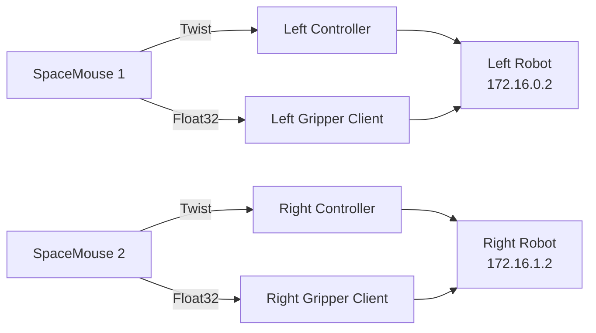

# Franka 双臂系统配置教程

本文档记录了将 `franka_spacemouse` 工作空间从单臂配置切换到双臂配置的所有改动。

## 目录
- [系统概述](#系统概述)
- [配置改动](#配置改动)
- [网络配置](#网络配置)
- [构建和启动](#构建和启动)
- [故障排除](#故障排除)

---

## 系统概述

### 硬件配置
- **左臂机器人**: Franka FR3 @ 172.16.0.2
- **右臂机器人**: Franka FR3 @ 172.16.1.2
- **SpaceMouse 设备**: 2 个 SpaceMouse Wireless BT

### 软件架构


---

## 配置改动

### 1. Launch 文件默认配置

**目的**: 将默认配置从单臂切换到双臂

#### 修改的文件

##### [joint_impedance_ik_controller.launch.py](file:///home/embint/teleop_ws/src/franka_spacemouse/src/franka_arm_controllers/launch/joint_impedance_ik_controller.launch.py#L107)
```diff
 DeclareLaunchArgument(
     "robot_config_file",
-    default_value="example_fr3_config.yaml",
+    default_value="fr3_duo_config.yaml",
     description="Name of the robot configuration file to load...",
 ),
```

##### [spacemouse_publisher.launch.py](file:///home/embint/teleop_ws/src/franka_spacemouse/src/spacemouse_publisher/launch/spacemouse_publisher.launch.py#L46)
```diff
 DeclareLaunchArgument(
     "config_file",
-    default_value="example_fr3_config.yaml",
+    default_value="fr3_duo_config.yaml",
     description="Name of the spacemouse configuration file to load",
 ),
```

##### [franka_gripper_client.launch.py](file:///home/embint/teleop_ws/src/franka_spacemouse/src/gripper_manager/launch/franka_gripper_client.launch.py#L52)
```diff
 DeclareLaunchArgument(
     "config_file",
-    default_value="example_fr3_config.yaml",
+    default_value="fr3_duo_config.yaml",
     description="Name of the gripper_manager configuration file to load",
 ),
```

### 2. SpaceMouse 设备路径修正

**目的**: 修正 SpaceMouse 设备路径以匹配实际硬件

#### 检测实际设备

运行以下命令找到 SpaceMouse 设备：
```bash
for device in /dev/hidraw*; do 
    echo "=== $device ==="; 
    udevadm info -a -n $device | grep -i "product\|manufacturer" | head -4
done
```

结果：
- `hidraw4`: SpaceMouse Wireless BT (左臂)
- `hidraw5`: SpaceMouse Wireless BT (右臂)

#### 修改配置文件

##### [fr3_duo_config.yaml](file:///home/embint/teleop_ws/src/franka_spacemouse/src/spacemouse_publisher/config/fr3_duo_config.yaml)
```diff
 LEFT:
   namespace: left
-  device_path: /dev/hidraw6
+  device_path: /dev/hidraw4
   operator_position_front: true
 RIGHT:
   namespace: right
-  device_path: /dev/hidraw7
+  device_path: /dev/hidraw5
   operator_position_front: true
```

---

## 网络配置

### PC 端网络设置

需要配置两个网络接口：

#### 左臂网络
```bash
# 接口名称: 根据实际网卡确定（例如 enp0s31f6）
IP 地址: 172.16.0.1
子网掩码: 255.255.255.0 (/24)
```

#### 右臂网络
```bash
# 接口名称: 根据实际网卡确定（例如 enp5s0）
IP 地址: 172.16.1.1
子网掩码: 255.255.255.0 (/24)
```

### 验证网络连接
```bash
# 测试左臂连接
ping 172.16.0.2

# 测试右臂连接
ping 172.16.1.2
```

### 机器人端配置

确保每台机器人的 Desk 界面已启用：
1. 访问 `https://172.16.0.2/desk` 和 `https://172.16.1.2/desk`
2. Settings → System → **启用 FCI (Franka Control Interface)**
3. 解锁机器人并进入 **Programming Mode**

---

## 构建和启动

### 1. 构建工作空间

```bash
cd ~/teleop_ws
colcon build
```

如果只修改了配置文件，可以单独构建相关包：
```bash
colcon build --packages-select franka_arm_controllers spacemouse_publisher gripper_manager
```

### 2. Source 环境

**每个新终端都需要执行**：
```bash
source /opt/ros/humble/setup.bash
source ~/franka_ros2_ws/install/setup.bash
source ~/teleop_ws/install/setup.bash
```

### 3. 启动双臂系统

#### 终端 1: 双臂控制器
```bash
ros2 launch franka_arm_controllers joint_impedance_ik_controller.launch.py
```

**说明**: 不需要指定 `robot_config_file`，默认已经是 `fr3_duo_config.yaml`

#### 终端 2: 双臂 SpaceMouse Publisher
```bash
ros2 launch spacemouse_publisher spacemouse_publisher.launch.py
```

#### 终端 3: 双臂夹爪管理器
```bash
ros2 launch gripper_manager franka_gripper_client.launch.py
```

### 4. 启动单臂系统（可选）

如果只想测试单臂，可以显式指定配置文件：

```bash
# 终端 1
ros2 launch franka_arm_controllers joint_impedance_ik_controller.launch.py \
  robot_config_file:=example_fr3_config.yaml

# 终端 2
ros2 launch spacemouse_publisher spacemouse_publisher.launch.py \
  config_file:=example_fr3_config.yaml

# 终端 3
ros2 launch gripper_manager franka_gripper_client.launch.py \
  config_file:=example_fr3_config.yaml
```

---

## 故障排除

### 问题 1: SpaceMouse 设备无法打开

**错误信息**:
```
easyhid.easyhid.HIDException: Failed to open device
```

**解决方案**:

1. **检查设备是否存在**:
   ```bash
   ls -l /dev/hidraw*
   ```

2. **找到正确的设备路径**:
   ```bash
   for device in /dev/hidraw*; do 
       udevadm info -a -n $device | grep -i "3Dconnexion"
   done
   ```

3. **更新配置文件** `spacemouse_publisher/config/fr3_duo_config.yaml` 中的 `device_path`

4. **重新构建**:
   ```bash
   cd ~/teleop_ws
   colcon build --packages-select spacemouse_publisher
   source install/setup.bash
   ```

### 问题 2: 功率限制违规 (Power Limit Violation)

**错误信息**:
```
libfranka: Move command aborted: motion aborted by reflex! ["power_limit_violation"]
```

**可能原因**:
- 机器人姿态不合适（关节接近极限）
- 有外力阻挡或碰撞
- 负载过重

**解决步骤**:
1. 在 Desk 界面手动移动机器人到中间姿态
2. 确保所有关节远离极限位置
3. 移除障碍物
4. 重新启动控制器

### 问题 3: FCI 连接被拒绝

**错误信息**:
```
libfranka: Connection to FCI refused. Please install FCI feature or enable FCI mode in Desk.
```

**解决方案**:
1. 访问机器人 Desk: `https://<robot_ip>/desk`
2. Settings → System
3. 启用 **FCI (Franka Control Interface)**
4. 如需要，重启机器人

### 问题 4: TCP 连接中断

**错误信息**:
```
libfranka: TCP connection got interrupted.
```

**可能原因**:
- 网络连接不稳定
- 机器人断电或重启
- 网线松动

**解决方案**:
1. 检查网线连接
2. 验证网络配置: `ping <robot_ip>`
3. 重启机器人和控制器

---

## 验证清单

在启动系统前，请确认：

- [ ] PC 端网络已正确配置（172.16.0.1/24 和 172.16.1.1/24）
- [ ] 可以 ping 通两台机器人（172.16.0.2 和 172.16.1.2）
- [ ] 两台机器人都已启用 FCI
- [ ] 两台机器人都已解锁并处于 Programming Mode
- [ ] SpaceMouse 设备路径与实际硬件匹配
- [ ] 工作空间已重新构建
- [ ] 环境变量已正确 source

---

## 配置文件概览

### 机器人控制器配置

[fr3_duo_config.yaml](file:///home/embint/teleop_ws/src/franka_spacemouse/src/franka_arm_controllers/config/fr3_duo_config.yaml)
- 左臂: namespace=`left`, IP=`172.16.0.2`
- 右臂: namespace=`right`, IP=`172.16.1.2`

### SpaceMouse 配置

[fr3_duo_config.yaml](file:///home/embint/teleop_ws/src/franka_spacemouse/src/spacemouse_publisher/config/fr3_duo_config.yaml)
- 左臂: namespace=`left`, device=`/dev/hidraw4`
- 右臂: namespace=`right`, device=`/dev/hidraw5`

### 夹爪管理器配置

[fr3_duo_config.yaml](file:///home/embint/teleop_ws/src/franka_spacemouse/src/gripper_manager/config/fr3_duo_config.yaml)
- 左臂: namespace=`left`
- 右臂: namespace=`right`

---

## 参考资料

- [Franka Robotics Documentation](https://frankaemika.github.io/docs/)
- [ROS 2 Humble Documentation](https://docs.ros.org/en/humble/)
- [franka_ros2 GitHub](https://github.com/frankaemika/franka_ros2)
